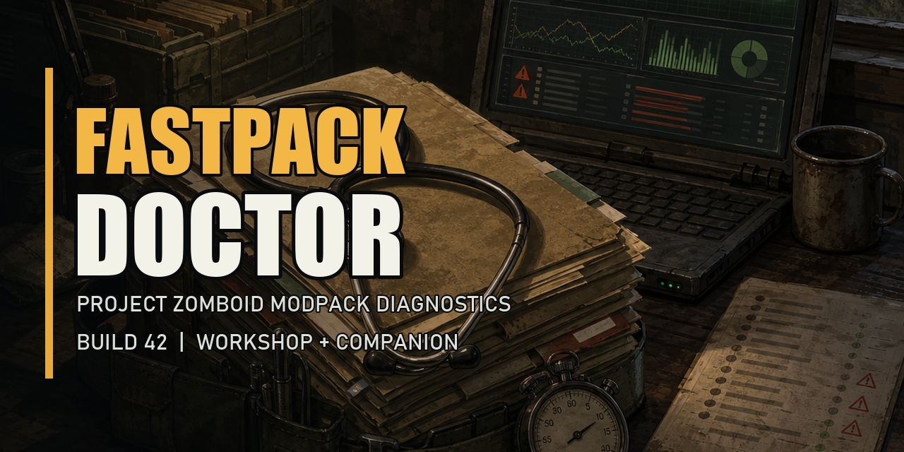

# Zomboid FastPack Doctor



[Русская версия](README_RU.md) | [Latest release](https://github.com/AntiLox12/Zomboid-FastPack-Doctor/releases/latest)

FastPack Doctor is a hybrid diagnostics toolkit for large Project Zomboid
Build 42 modpacks. It finds measurable configuration and content problems
without claiming to rewrite the native game loader.

## What is included

- **Workshop mod:** an in-game runtime report, cooperative deferred-work API,
  and lightweight profiling for FastPack-compatible callbacks.
- **Windows Companion:** a pre-launch scanner for mod sizes, duplicate
  definitions, map overlaps, dependencies, load-order risks, console errors,
  outdated layouts, and safe-mode candidates.
- **HTML and JSON reports:** portable reports that can be compared after
  Workshop updates.

## Workshop users

1. Subscribe to **Zomboid FastPack Doctor** and enable it in the Build 42 mod
   manager.
2. Load a world.
3. Open the pause menu, open the active mod list, and select
   **FastPack Report**.
4. Use **Get full Companion** for the deeper pre-launch scanner.

Subscribing through Steam installs only the in-game mod. Steam Workshop cannot
install or run the external Companion application.

## Windows Companion

Download `FastPackDoctor-Windows-v0.1.1.zip` from the
[latest release](https://github.com/AntiLox12/Zomboid-FastPack-Doctor/releases/latest),
extract it, and run:

```powershell
.\FastPackDoctor.exe scan --safe-mode
```

Steam, Workshop, the active Build 42 profile, `console.txt`, and the runtime
report are detected automatically. Results are written to
`outputs\fastpack-report\`.

Developers can run the source version:

```powershell
python .\companion\fastpack.py scan --safe-mode
python -m unittest discover -s tests -v
```

## Current limits

- The Lua mod does not patch the Java loader.
- Runtime profiling covers callbacks registered through the FastPack API.
- A duplicate script ID is a potential override, not proof of incompatibility.
- Safe-mode profiles are generated for review and are never installed
  automatically.

See [Companion usage](docs/USAGE.md) and the
[modder API](docs/MODDER_API.md).
